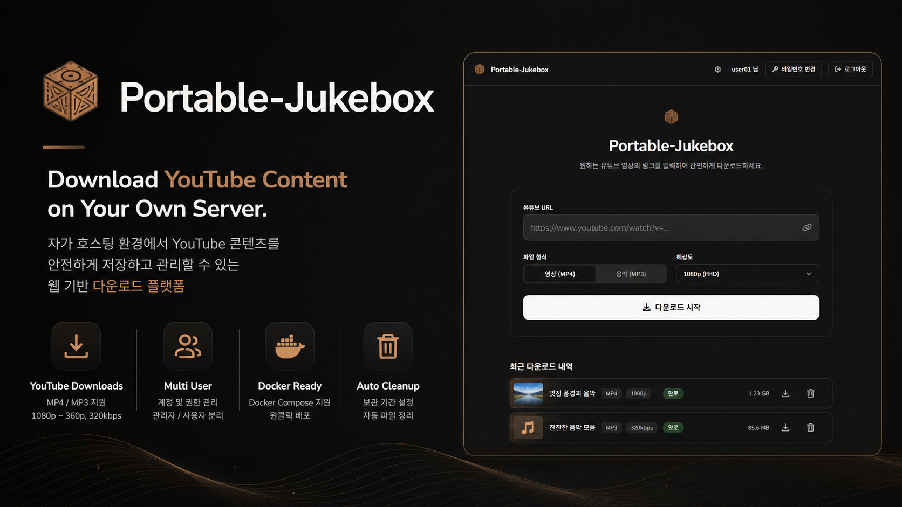
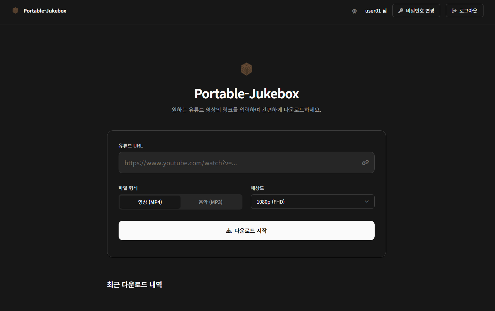

# Portable-Jukebox



자가 호스팅 YouTube 다운로더 웹 서비스. 원하는 영상과 음악을 서버에 직접 저장하고 관리합니다.

## 만든 이유

유튜브 영상이나 음악을 다운로드할 때 서드파티 사이트는 광고가 넘치고, 로컬 CLI 도구는 가족이나 팀원이 쓰기 불편합니다. Portable-Jukebox는 내 서버에 직접 올려두고, 누구나 브라우저에서 링크만 붙여넣으면 파일을 내려받을 수 있도록 만들었습니다. 계정 관리와 자동 정리 기능도 있어 NAS나 홈 서버에 올려두고 가족이나 팀원과 함께 쓰기에 적합합니다.

## 주요 기능



- **YouTube 다운로드** — MP4(1080p/720p/480p/360p) 및 MP3(320/192/128/96kbps) 지원
- **실시간 진행률** — HTMX 폴링 기반 다운로드 상태 표시
- **파일 직접 다운로드** — 완료된 파일을 브라우저로 바로 내려받기
- **다운로드 이력 정리** — 완료·오류 항목 개별 삭제 (파일 및 이력 동시 제거)
- **다크/라이트 모드** — 시스템 설정 자동 감지, 헤더 토글로 수동 전환, 설정 유지
- **계정 관리** — 관리자/사용자 역할 분리, 최초 로그인 시 비밀번호 변경 강제
- **자동 로그인** — 보안 토큰 기반 30일 자동 로그인 지원
- **파일 자동 삭제** — 보관 기간 설정 후 매일 자정 만료 파일 자동 삭제
- **시스템 로그** — 로그인/로그아웃, 다운로드, 계정 변경, 설정 변경 이력 통합 기록
- **패스워드 복잡성 설정** — 최소 자릿수, 대문자/숫자/특수문자 요구사항 관리자 설정
- **Docker 배포** — GitHub Actions 자동 빌드·릴리즈

## 기술 스택

| 구분 | 사용 기술 |
|---|---|
| Backend | Python 3.12, FastAPI, SQLAlchemy, SQLite (WAL) |
| Frontend | HTMX, Alpine.js, Tailwind CSS, Jinja2 |
| 다운로드 | yt-dlp, ffmpeg |
| 인증 | Starlette SessionMiddleware, bcrypt |
| 배포 | Docker, GitHub Actions |

> 모든 정적 자산(JS, CSS, 폰트, 아이콘)은 Docker 빌드 시 다운로드해 로컬 서빙합니다. 외부 CDN 의존성 없음.

## 빠른 시작

### Docker Compose (권장)

```bash
# 1. 설정 파일 다운로드
curl -L https://github.com/HelloJamong/portable-jukebox/releases/latest/download/docker-compose.yml -o docker-compose.yml
curl -L https://github.com/HelloJamong/portable-jukebox/releases/latest/download/default.env.example -o .env

# 2. 필수 디렉터리 생성
mkdir -p downloads data

# 3. .env 수정 (SECRET_KEY, ADMIN_USERNAME, ADMIN_PASSWORD 변경 필수)
nano .env

# 4. 실행
docker compose up -d
```

브라우저에서 `http://localhost:8000` 접속 후 관리자 계정으로 로그인합니다.

> **필수 디렉터리**
> | 경로 | 용도 |
> |---|---|
> | `./downloads` | 다운로드 파일 저장소 |
> | `./data` | SQLite 데이터베이스 저장소 |

### 이미지 업데이트

새 버전이 릴리즈되면 아래 명령으로 업데이트합니다.

```bash
docker compose pull && docker compose up -d
```

### 로컬 개발

```bash
# 의존성 설치
uv sync

# 서버 실행
uv run uvicorn src.main:app --reload
```

## 환경 변수

| 변수 | 설명 | 기본값 |
|---|---|---|
| `SECRET_KEY` | 세션 암호화 키 | `dev-secret-...` |
| `ADMIN_USERNAME` | 초기 관리자 아이디 | `admin` |
| `ADMIN_PASSWORD` | 초기 관리자 비밀번호 | `admin1234` |
| `DOWNLOAD_DIR` | 다운로드 저장 경로 | `/downloads` |
| `DATABASE_URL` | SQLite DB 경로 | `sqlite:////app/data/jukebox.db` |

### SECRET_KEY 발급

운영 환경에서는 반드시 충분히 긴 무작위 값을 사용하세요.

```bash
python -c "import secrets; print(secrets.token_urlsafe(32))"
```

생성된 값을 `.env` 파일의 `SECRET_KEY`에 설정합니다.

## 디렉터리 구조

```
src/
├── main.py          # FastAPI 앱 진입점, 스케줄러 초기화
├── models.py        # SQLAlchemy 모델
├── auth.py          # 인증, 비밀번호 복잡성 검증
├── activity.py      # 시스템 로그 헬퍼
├── downloader.py    # yt-dlp 다운로드 엔진
├── scheduler.py     # APScheduler 자동 삭제
├── routers/
│   ├── user.py      # 사용자 라우트 (대시보드, 다운로드, 인증)
│   └── admin.py     # 관리자 라우트 (계정/설정/로그)
└── templates/       # Jinja2 템플릿
```

## 디자인

본 프로젝트 디자인은 [Vinsign](https://vinsign.app/ko-kr)을 통해 제작되었습니다.

## 라이선스

MIT License — 자세한 내용은 [LICENSE](LICENSE) 파일을 참고하세요.
